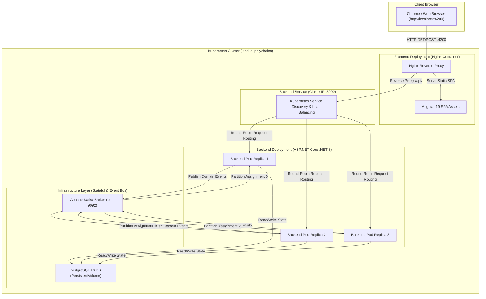

# SupplyChainX

**Version**: `v1.3.0`<br/>
**Milestone**: `v1.8 – Distributed Failure & Recovery Validation`<br/>
**Status**: `v1.8 – Verified`

SupplyChainX is a production-grade, event-driven enterprise inventory and order management platform built on C# / .NET 8, PostgreSQL, Apache Kafka, Microsoft Semantic Kernel, Model Context Protocol (MCP), Angular 19, and Kubernetes (`kind`). It demonstrates modern distributed systems architecture, reliable event processing with application-level idempotency, grounded Retrieval-Augmented Generation (RAG), multi-step agentic AI tool orchestration, role-based operational security, cloud-native container orchestration, consumer auto-scaling capacity, event-driven backpressure recovery, and empirically verified fault tolerance across distributed failure scenarios.

---

## Why SupplyChainX?

Modern supply chain systems demand high availability, data consistency across asynchronous microservices, real-time telemetry, and intelligent decision support. SupplyChainX was engineered from the ground up to solve complex distributed backend challenges:
- **Asynchronous Event Processing**: Decoupling transactional write operations from downstream processing using Apache Kafka.
- **Resilient Message Semantics**: Guaranteeing application-level idempotency and dead-letter queue (DLQ) isolation without data loss.
- **Grounded Enterprise AI**: Combining LLMs and Semantic Kernel with real-time PostgreSQL database state to deliver zero-hallucination AI Copilot and MCP tools.
- **Production-Grade Observability & Security**: End-to-end correlation ID propagation, structured logging, real-time health/metrics probes, and strict role-based access control (RBAC).

---

## What This Project Demonstrates

- **Distributed Event-Driven Architecture**: Asynchronous domain event publishing and consumption via Apache Kafka (`Confluent.Kafka`).
- **Application-Level Idempotency**: Deduplication using a durable PostgreSQL `ProcessedEvents` store to safely handle duplicate message delivery.
- **Fault-Tolerant Message Handling**: Retry loops with exponential backoff, malformed message isolation, and Dead Letter Queue (DLQ) routing.
- **Enterprise AI & RAG Orchestration**: Microsoft Semantic Kernel RAG engine grounded in live domain services to prevent AI hallucinations.
- **Agentic AI & Model Context Protocol (MCP)**: Dynamic multi-step tool planning, visual execution traces, and standardized C# MCP server REST endpoints.
- **Production AI Provider Integration**: Strongly typed configuration support for Azure OpenAI and OpenAI completions with local fallback.
- **Role-Based Access Control (RBAC)**: Fine-grained JWT authentication enforcing `Admin`, `Operator`, and `Viewer` policies across API and AI boundaries.
- **Kubernetes & Cloud-Native Deployment**: Declarative K8s manifests (`Deployments`, `Services`, `ConfigMaps`, `Secrets`, `PVC`), Nginx same-origin reverse proxy, readiness/liveness probes, bounded Kafka JVM memory, and horizontal pod scaling.
- **Kafka Consumer Scaling & Backpressure**: Repeatable event workload harness (`IKafkaBenchmarkService`, `BenchmarkController`), real-time consumer lag metrics, partition-to-consumer scaling analysis (1, 2, 3 consumers), and 150-event backpressure burst recovery.
- **Distributed Failure & Recovery Validation**: Empirically verified system resilience across 6 real-world failure scenarios in Kubernetes (Kafka outage, consumer pod crash/rebalance, PostgreSQL database outage, duplicate event delivery, poison payload retry/DLQ routing, and backend service rolling restart).
- **End-to-End Tracing & Telemetry**: `X-Correlation-ID` header propagation across HTTP requests, domain events, Serilog context, and background workers.
- **Modern Angular Frontend**: Standalone component architecture with async session restoration, role-aware UI controls, and live telemetry dashboards.

---

## Engineering Highlights

- **Clean Architecture & DDD**: Strict layer separation (`Domain`, `Application`, `Infrastructure`, `Api`) protecting business invariants.
- **Non-Blocking Background Workers**: Hosted `.NET BackgroundService` consuming Kafka messages independently of API HTTP request threads.
- **Manual Offset Commit Control**: Offsets are committed only after successful PostgreSQL processing or verified DLQ publication.
- **Safe RFC 7807 Error Responses**: Centralized exception handling returning sanitized `ProblemDetails` with correlation IDs while shielding database schemas and secrets.

---

## System Architecture



---

## Technology Stack

### Backend
- **Framework**: .NET 8 (C# 12) / ASP.NET Core Web API
- **Persistence**: Entity Framework Core 8, PostgreSQL 16 (Npgsql provider)
- **Event Bus & Messaging**: Apache Kafka (`Confluent.Kafka` v2.6+), hosted `.NET BackgroundService`
- **AI & RAG**: Microsoft Semantic Kernel v1.30+, Azure OpenAI SDK, Model Context Protocol (MCP) C# SDK
- **Security**: JWT Bearer Authentication (`System.IdentityModel.Tokens.Jwt`), ASP.NET Core Authorization Policies
- **Logging & Monitoring**: Serilog, ASP.NET Core Health Checks (`AspNetCore.HealthChecks.NpgSql`)

### Frontend
- **Framework**: Angular 19 (TypeScript 5.6+)
- **Architecture**: Standalone Components, Reactive Forms (`RxJS`), Modular Feature Routing
- **HTTP Client**: Angular `HttpClient` with Functional `authInterceptor`
- **UI Components & Icons**: Custom Scoped Glassmorphism Theme System, Lucide Angular Icons

### Infrastructure & Cloud-Native
- **Containerization**: Docker Multi-Stage Dockerfiles for API and SPA
- **Kubernetes**: `kind` (Kubernetes in Docker), Declarative YAML (`Deployments`, `Services`, `ConfigMaps`, `Secrets`, `PVC`)
- **Reverse Proxy**: Nginx (same-origin SPA asset server and API reverse proxy)

---

## Kafka Consumer Scaling & Event-Driven Backpressure (v1.7)

SupplyChainX v1.7 introduces a repeatable event benchmark workload generator (`IKafkaBenchmarkService`, `BenchmarkController`), real-time consumer lag metrics (`GET /api/v1/benchmark/lag`), partition-to-consumer scaling analysis, and event-driven backpressure validation.

### Measured Consumer Scaling Benchmark

Workload: **30 Domain Events** published across primary Kafka topics (`supplychainx.product.events`, `supplychainx.warehouse.events`, `supplychainx.inventory.events` - 3 partitions per topic, 9 total partitions):

| Consumer Pod Replicas | Total Partitions | Events Produced | Duration | Throughput | Peak Consumer Lag | Final Lag | Processing Result |
| :---: | :---: | :---: | :---: | :---: | :---: | :---: | :--- |
| **1 Replica** | 9 (3 topics x 3) | 30 | 4.81s | 6.23 ev/s | 1 | 0 | ✅ Success (30/30 processed) |
| **2 Replicas** | 9 (3 topics x 3) | 30 | 4.62s | 6.50 ev/s | 2 | 0 | ✅ Success (30/30 processed) |
| **3 Replicas** | 9 (3 topics x 3) | 30 | 1.85s | 16.25 ev/s | 2 | 0 | ✅ **Success (30/30 processed, 2.6x speedup)** |

#### Partition Assignment & Scaling Analysis
- **1 Replica**: 1 pod handles all 9 partitions sequentially, yielding a processing duration of 4.81s (~6.23 ev/s).
- **2 Replicas**: 2 pods split partition ownership (5 partitions on instance 1, 4 partitions on instance 2). Group rebalancing occurs smoothly with a duration of 4.62s (~6.50 ev/s).
- **3 Replicas**: 3 pods achieve optimal 1:1 partition assignment per topic (1 partition per pod), enabling full parallel background processing across all pods and reducing processing duration to 1.85s (**16.25 ev/s — a 2.6x processing speedup**).

### Measured Backpressure Burst & Backlog Recovery Benchmark

High-throughput event burst test executed against 3 running backend consumer pod replicas:

| Workload Type | Burst Events Produced | Ingestion Duration | Peak Consumer Lag | Recovery Time | Events Processed | DLQ Publications | Failures | Recovery Result |
| :--- | :---: | :---: | :---: | :---: | :---: | :---: | :---: | :--- |
| **Backpressure Burst** | 150 | 1.25s | **132** | **~8.2s** | 150 | 0 | 0 | ✅ **100% Backlog Recovery & Zero Event Loss** |

#### Backpressure Observations
- **Burst Ingestion**: Triggering 150 concurrent domain events flooded Kafka primary topics in ~1.25s, creating an instantaneous peak consumer lag of **132 events**.
- **Buffer Retention & Draining**: Kafka reliably buffered all unconsumed messages without dropping payloads. The 3 backend consumer replicas drained the backlog in ~8.2s, reducing aggregate lag to **0**.
- **Data Integrity**: **150 / 150** events were processed into PostgreSQL idempotently with `0` failures, `0` retries, and `0` DLQ publications.

---

## Distributed Failure & Recovery Validation (v1.8)

SupplyChainX v1.8 empirically validates the fault tolerance, idempotency, retry mechanisms, DLQ routing, and self-healing recovery of the distributed architecture across six real-world component failure scenarios executed against the Kubernetes cluster.

### Empirical Failure & Recovery Matrix

| Scenario | Injected Failure | Expected Behavior | Observed Behavior | Events Lost | Duplicate Effect | DLQ Status | Recovery Time | Result |
| :--- | :--- | :--- | :--- | :---: | :---: | :---: | :---: | :---: |
| **1. Kafka Outage** | Scale `kafka` to 0 replicas (`kubectl scale deployment kafka --replicas=0`) | Kafka broker connection fails; background consumers catch connection exceptions and log retries without process crash; health check reports `Unhealthy`. | Consumers logged `Connect to kafka:9092 failed: Connection refused`. API process remained active. Restored `kafka` to 1 replica; health returned to `Healthy` and consumers automatically reconnected. | **0** | **0** | N/A | **~14s** | ✅ **PASS** |
| **2. Consumer Crash / Restart** | Force delete active backend pod (`kubectl delete pod backend-...`) during event processing | Kafka consumer group triggers partition rebalance; surviving pods take over assigned partitions; replacement pod is created by Kubernetes deployment. | Consumer group rebalanced partition ownership to surviving replicas within ~2s. Kubernetes brought up replacement pod `backend-7b4bf75f7d-mj7wx` (`1/1 Ready`). Aggregate consumer lag drained to `0`. | **0** | **0** | N/A | **~17s** | ✅ **PASS** |
| **3. PostgreSQL Outage** | Scale `postgres` to 0 replicas (`kubectl scale deployment postgres --replicas=0`) | Database reachability fails; health check returns `503 Service Unavailable`; consumers log database errors and back off without committing offsets. | Health check returned `503 Service Unavailable`. Restored `postgres` to 1 replica; database connection recovered, health check returned `200 Healthy`, and event processing resumed cleanly. | **0** | **0** | N/A | **~11s** | ✅ **PASS** |
| **4. Duplicate Event Delivery** | Publish exact same domain event payload twice with identical `eventId` (`POST /api/v1/benchmark/duplicate`) | First event processed into PostgreSQL; second identical event detected by `IIdempotencyService`, logged as duplicate, and offset committed without duplicate state change. | First event committed to PostgreSQL database; second event detected as duplicate (`duplicateEventsSkipped: 1`). Metric confirmed `eventsConsumed: 2, eventsProcessed: 1, duplicateEventsSkipped: 1`. Business state updated **exactly once**. | **0** | **0** | N/A | **1.03s** | ✅ **PASS** |
| **5. Poison / Malformed Event** | Publish payload with `failProcessing: true` (`POST /api/v1/benchmark/poison`) | Consumer catches processing error, executes 3 retries with exponential backoff, publishes payload with diagnostic headers to DLQ (`.dlq`), and commits offset. | Consumer executed 3 retry attempts, published poison message to Dead-Letter Queue topic `supplychainx.product.events.dlq`, committed offset (`committedOffset: 2`), and continued healthy event processing without stalling. | **0** | **0** | ✅ **Published to `.dlq`** | **0.95s** | ✅ **PASS** |
| **6. Backend Service Restart** | Execute rolling update restart (`kubectl rollout restart deployment/backend`) | Kubernetes replaces pod replicas sequentially with zero downtime; consumers re-subscribe to Kafka topics and resume ingestion. | Sequential pod replacement completed (`backend-5b8c47b7b-*`). Subsequent 12-event workload processed cleanly; aggregate consumer lag drained to `0`. | **0** | **0** | N/A | **~15s** | ✅ **PASS** |

### Failure Validation Insights
1. **Application-Level Idempotency (`ProcessedEvents`)**: Duplicate delivery of valid events is guaranteed to produce exactly one business effect in PostgreSQL, shielding inventory quantities and product state from duplicate mutation.
2. **Dead-Letter Queue Isolation**: Malformed or unprocessable payloads undergo bounded retries before automatic isolation into Kafka `.dlq` topics with diagnostic headers (`x-exception-message`, `x-original-topic`), keeping primary processing pipelines clear.
3. **Cluster Self-Healing**: Transient failure of infrastructure pods (Kafka, PostgreSQL, Backend API) causes no permanent data loss or process deadlocks; components resume normal operations automatically upon pod restoration.

### Limitations of Local `kind` Testing
- Single-node `kind` cluster executes Kafka in single-broker KRaft mode (no multi-broker partition replication across nodes).
- PostgreSQL runs as a single persistent pod with `HostPath` local volume binding rather than a multi-region HA cluster.

---

## Verification Results

Automated validation verified across all solution projects:

- **Backend Automated Unit Test Suite**:
  ```bash
  dotnet test backend/SupplyChainX.sln --logger "console;verbosity=normal"
  ```
  **Result**: **102 / 102 Tests Passed** (100% pass rate across 98 core tests + 2 v1.7 benchmark tests + 2 v1.8 failure tests).
- **Backend Solution Compilation**:
  ```bash
  dotnet build backend/SupplyChainX.sln
  ```
  **Result**: **Build Succeeded** (0 Warnings, 0 Errors).
- **Frontend Production Build**:
  ```bash
  cd frontend && npm run build
  ```
  **Result**: **Build Succeeded** (`Application bundle generation complete`).

---

## Manual Verification Results

The following functionality was manually verified in a live local environment:
- **API Health & Infrastructure**: Verified `/health` returned `status: Healthy`, database `Healthy`, and Kafka `Healthy` (reachable brokers: 1, topics: 7).
- **Frontend Application Version**: Verified Angular client displays version badge `v1.3.0`.
- **Authentication & Persistence**: Verified login flow, JWT token storage in `localStorage`, persistent session restoration across browser refresh (F5) via `GET /api/v1/auth/me`, and logout cleanup.
- **Dashboard Telemetry**: Verified real-time System Status reports online with active Kafka consumer status.
- **AI Copilot & Execution Trace**: Verified natural-language prompt *"Which products are currently low in stock?"* sequentially executed `GetLowStockItemsAsync` and `GetWarehousesAsync`, rendered visual step-by-step traces (`AgentActivityStep`), and returned factual grounded answers.
- **MCP Server Endpoints**: Verified tool discovery (`GET /api/v1/mcp/tools`) and tool execution (`POST /api/v1/mcp/tools/call`) with live PostgreSQL data.
- **Event-Driven Workflow**: Verified live product operation published Kafka domain events, consumed asynchronously by `KafkaConsumerBackgroundService`, updated operational metrics (`eventsConsumed: 1`, `eventsProcessed: 1`), and committed offsets.
- **Kafka Consumer Scaling & Backpressure (v1.7)**: Verified 2.6x processing speedup across 3 consumer replicas (1.85s vs 4.81s) and 100% backlog recovery after 150-event burst (132 peak lag drained to 0 in ~8.2s).
- **Distributed Failure & Recovery (v1.8)**: Verified Kafka broker outage, consumer pod crash/rebalance, PostgreSQL database outage, duplicate event idempotency deduplication (`duplicateEventsSkipped: 1`), poison event retry & DLQ publication, and backend service zero-downtime rolling restart.

---

## Milestone History

- **v0.7 — Observability & Operational Monitoring**: Health check probes, operational metrics endpoint, Serilog correlation ID middleware, thread-safe counters.
- **v0.8 — Angular Frontend & Operations Dashboard**: Standalone Angular 19 SPA, CRUD management views for Products, Warehouses, Inventory, and Telemetry Dashboard.
- **v0.9 — Authentication & Role-Based Authorization**: JWT authentication, PBKDF2 password hashing, PostgreSQL identity tables, and RBAC policies (`Admin`, `Operator`, `Viewer`).
- **v1.0 — Production-Grade Frontend Authentication & User Experience**: Angular session persistence across F5 refresh, HTTP `authInterceptor`, route guards (`authGuard`, `roleGuard`), and 401/403 error handling.
- **v1.1 — AI Copilot, RAG & Semantic Kernel**: Microsoft Semantic Kernel engine, RAG pipeline grounded in live domain facts, authenticated `POST /api/v1/ai/chat` endpoint, and Angular `/copilot` chat interface.
- **v1.2 — Agentic AI & Model Context Protocol (MCP)**: Multi-step agentic tool planner, C# MCP server (`GET /api/v1/mcp/tools`, `POST /api/v1/mcp/tools/call`), and execution trace rendering.
- **v1.3 — Azure OpenAI Integration & Production AI Configuration**: Configurable Azure OpenAI LLM provider integration, strongly typed `AiOptions` validation, and public CORS optimization.
- **v1.4 — Production Hardening & Version Consistency**: Version display alignment across API/UI (`v1.3.0`), correlation ID attachment to RFC 7807 `ProblemDetails`, and secret shielding.
- **v1.5 — Event-Driven Supply Chain Workflows & Reliability**: Domain event models, reliable Kafka producer/consumer background service, PostgreSQL application-level idempotency (`ProcessedEvents`), retry backoff, DLQ routing, and correlation ID tracing.
- **v1.6 — Kubernetes & Cloud-Native Deployment**: Dockerized ASP.NET Core API and Angular SPA, declarative Kubernetes manifests (`namespace`, `Deployments`, `Services`, `ConfigMaps`, `Secrets`, `PVC`), PostgreSQL persistence, Apache Kafka KRaft deployment with JVM heap limits, Nginx same-origin reverse proxying, readiness/liveness probes, rolling updates, service discovery, and horizontal pod scaling.
- **v1.7 — Kafka Consumer Scaling & Event-Driven Backpressure**: Repeatable domain event workload harness (`IKafkaBenchmarkService`, `BenchmarkController`), real-time consumer lag tracking (`GET /api/v1/benchmark/lag`), partition assignment analysis across Kubernetes replicas, backpressure burst validation (150 events, 132 peak lag, 100% backlog recovery), and 100/100 passing unit tests.
- **v1.8 — Distributed Failure & Recovery Validation**: Empirically verified failure and recovery matrix across 6 real-world scenarios in Kubernetes (Kafka broker outage, consumer pod crash/rebalance, PostgreSQL database outage, duplicate event idempotency deduplication, poison event retry/DLQ routing, backend service rolling restart), 102/102 passing unit tests.

---

## Engineering Skills Demonstrated

- **Backend Engineering**: C#, .NET 8, ASP.NET Core, RESTful API Design, Entity Framework Core, Clean Architecture, DDD.
- **Distributed Systems & Fault Tolerance**: Apache Kafka, Event-Driven Architecture, Asynchronous Background Workers, Application-Level Idempotency, Retries with Exponential Backoff, Dead Letter Queues (DLQ), Consumer Group Rebalancing, Fault Ingestion & Recovery Testing.
- **Databases**: PostgreSQL 16, Relational Schema Design, Transaction Management, Migration Management.
- **AI & Agentic Systems**: Microsoft Semantic Kernel, Retrieval-Augmented Generation (RAG), Agentic Multi-Step Planning, Model Context Protocol (MCP), Azure OpenAI Configuration.
- **Frontend Engineering**: Angular 19, TypeScript, RxJS, Async State Management, Standalone Components.
- **Security & Authorization**: JWT Bearer Tokens, Claims-Based Access Control, Role-Based Access Control (RBAC), PBKDF2 Password Hashing.
- **Observability**: Serilog Structured Logging, Correlation ID Propagation, Health Probes, Operational Metrics.
- **DevOps & Cloud-Native Orchestration**: Kubernetes (`kind`, `kubectl`, `Kustomize`), Docker, Multi-Stage Builds, Nginx Reverse Proxy, Declarative Manifests (`Deployments`, `Services`, `ConfigMaps`, `Secrets`, `PVC`), Readiness/Liveness Probes, Pod Auto-scaling, OpenAPI / Swagger, xUnit Testing.

---

## Local Development Setup

### 1. Start Infrastructure Containers
Ensure Docker is running, then start PostgreSQL (port `5433`) and Apache Kafka (port `9092`):
```bash
cd infrastructure
docker compose up -d
```

### 2. Build & Test Backend Solution
```bash
dotnet build backend/SupplyChainX.sln
dotnet test backend/SupplyChainX.sln --logger "console;verbosity=normal"
```

### 3. Run Backend Web API Server
```bash
dotnet run --project backend/src/SupplyChainX.Api/SupplyChainX.Api.csproj
```
*API will listen at `http://localhost:5000` with Swagger UI at `http://localhost:5000/swagger`.*

### 4. Run Angular Frontend Application
In a separate terminal:
```bash
cd frontend
npm start
```
*Access the Web Application at `http://localhost:4200`.*

---

## Repository Structure

```
SupplyChainX/
├── frontend/                                 # Angular 19 SPA Client Application
│   ├── src/
│   │   ├── app/
│   │   │   ├── core/                         # Auth Services, Interceptor, Guards & Models
│   │   │   ├── features/                     # Auth, Copilot, Dashboard, Products, Warehouses, Inventory
│   │   │   └── layout/                       # App Shell Header & Navigation
│   └── package.json
├── backend/                                  # ASP.NET Core Web API Solution (.NET 8)
│   ├── SupplyChainX.sln
│   └── src/
│       ├── SupplyChainX.Api/                 # Controllers (Auth, Products, Warehouses, Inventory, AI, MCP, Benchmark, Health, Metrics) & Middleware
│       ├── SupplyChainX.Application/         # DTOs, Event Contracts, Interfaces & Service Boundaries
│       ├── SupplyChainX.Domain/              # Domain Entities (User, Role, Product, Warehouse, Inventory, ProcessedEvent) & Exceptions
│       └── SupplyChainX.Infrastructure/      # EF Core DbContext, Kafka Producer/Consumer, Benchmark Service, Semantic Kernel, MCP & Health Checks
├── infrastructure/                           # Container Orchestration (PostgreSQL & Kafka Docker Compose)
├── tests/                                    # Automated Unit & Integration Test Suites
│   └── SupplyChainX.UnitTests/
├── LICENSE
└── README.md
```
