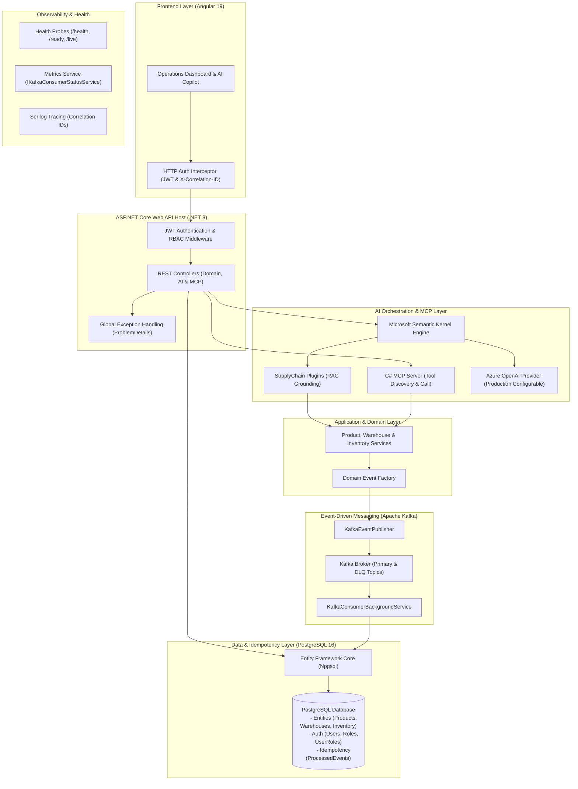
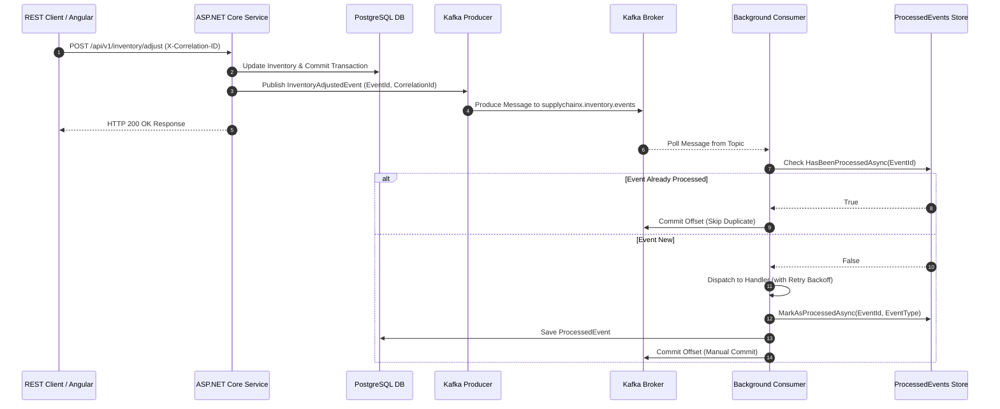

# SupplyChainX

**Version**: `v1.3.0`<br/>
**Milestone**: `v1.5 – Event-Driven Supply Chain Workflows & Reliability`<br/>
**Status**: `v1.5 – Verified`

SupplyChainX is a production-grade, event-driven enterprise inventory and order management platform built on C# / .NET 8, PostgreSQL, Apache Kafka, Microsoft Semantic Kernel, Model Context Protocol (MCP), and Angular 19. It demonstrates modern distributed systems architecture, reliable event processing with application-level idempotency, grounded Retrieval-Augmented Generation (RAG), multi-step agentic AI tool orchestration, and role-based operational security.

---

## Why SupplyChainX?

Modern supply chain systems demand high availability, data consistency across asynchronous microservices, real-time telemetry, and intelligent decision support. SupplyChainX was engineered from the ground up to solve complex distributed backend challenges:
- **Asynchronous Event Processing**: Decoupling transactional write operations from downstream processing using Apache Kafka.
- **Resilient Message Semantics**: Guaranteeing application-level idempotency and dead-letter queue (DLQ) isolation without data loss.
- **Grounded Enterprise AI**: Combining LLMs and Semantic Kernel with real-time PostgreSQL database state to deliver zero-hallucination AI Copilot and MCP tools.
- **Production-Grade Observability & Security**: End-to-end correlation ID propagation, structured logging, real-time health/metrics probes, and strict role-based access control (RBAC).

---

## What This Project Demonstrates

- **Distributed Event-Driven Architecture**: Asynchronous domain event publishing and consumption via Apache Kafka (`Confluent.Kafka`).
- **Application-Level Idempotency**: Deduplication using a durable PostgreSQL `ProcessedEvents` store to safely handle duplicate message delivery.
- **Fault-Tolerant Message Handling**: Retry loops with exponential backoff, malformed message isolation, and Dead Letter Queue (DLQ) routing.
- **Enterprise AI & RAG Orchestration**: Microsoft Semantic Kernel RAG engine grounded in live domain services to prevent AI hallucinations.
- **Agentic AI & Model Context Protocol (MCP)**: Dynamic multi-step tool planning, visual execution traces, and standardized C# MCP server REST endpoints.
- **Production AI Provider Integration**: Strongly typed configuration support for Azure OpenAI and OpenAI completions with local fallback.
- **Role-Based Access Control (RBAC)**: Fine-grained JWT authentication enforcing `Admin`, `Operator`, and `Viewer` policies across API and AI boundaries.
- **End-to-End Tracing & Telemetry**: `X-Correlation-ID` header propagation across HTTP requests, domain events, Serilog context, and background workers.
- **Modern Angular Frontend**: Standalone component architecture with async session restoration, role-aware UI controls, and live telemetry dashboards.

---

## Engineering Highlights

- **Clean Architecture & DDD**: Strict layer separation (`Domain`, `Application`, `Infrastructure`, `Api`) protecting business invariants.
- **Non-Blocking Background Workers**: Hosted `.NET BackgroundService` consuming Kafka messages independently of API HTTP request threads.
- **Manual Offset Commit Control**: Offsets are committed only after successful PostgreSQL processing or verified DLQ publication.
- **Safe RFC 7807 Error Responses**: Centralized exception handling returning sanitized `ProblemDetails` with correlation IDs while shielding database schemas and secrets.

---

## System Architecture



### Event-Driven Data Workflow



---

## Key Engineering Features

### 1. Event-Driven Architecture
SupplyChainX utilizes Apache Kafka to decouple transactional state changes from downstream asynchronous event processing.
- **Domain Events**: Strongly typed contracts implementing `EventId`, `OccurredOnUtc`, `EventType`, `EventVersion`, aggregate identifiers, and contextual payloads without exposing internal credentials.
  - `ProductCreatedEvent` & `ProductUpdatedEvent` & `ProductDeletedEvent`
  - `WarehouseCreatedEvent` & `WarehouseUpdatedEvent` & `WarehouseDeletedEvent`
  - `InventoryAdjustedEvent`
- **Topic Provisioning**: Automated startup provisioning of primary topics (`supplychainx.product.events`, `supplychainx.warehouse.events`, `supplychainx.inventory.events`) and dead-letter queue topics (`*.dlq`).

### 2. Reliable Kafka Consumer & Failure Isolation
The background message processing engine is implemented via `.NET BackgroundService`:
- **Manual Offset Commits**: `EnableAutoCommit = false` ensures Kafka offsets are committed **only** after successful database handling or verified DLQ publication.
- **Transient Failure Retries**: Automatic retry handling with configurable attempts (`MaxRetryAttempts = 3`) and exponential backoff (`RetryDelayMs * 2^(attempt-1)`).
- **Dead Letter Queue (DLQ) Routing**: Permanently failing messages are routed to dedicated `.dlq` topics accompanied by rich diagnostic headers (`x-original-topic`, `x-original-partition`, `x-original-offset`, `x-exception-message`, `x-failed-at-utc`, `x-retry-attempts`, `x-event-id`, `x-event-type`).
- **Malformed Message Isolation**: Invalid JSON payloads or messages missing `eventId` trigger structured error logs and metrics counters (`RecordMalformed`) while committing the offset to prevent infinite loop blockage.

### 3. Application-Level Idempotency
To guard against duplicate message delivery inherent in distributed networks, SupplyChainX implements **application-level idempotency** using PostgreSQL:
- Before processing an event, `IIdempotencyService.HasBeenProcessedAsync` checks the PostgreSQL `ProcessedEvents` table.
- If the `EventId` exists, the consumer increments the `duplicateEventsSkipped` counter, logs a diagnostic warning, and commits the offset without re-executing domain handlers.
- If new, the handler executes, records the event in `ProcessedEvents`, and commits the offset within a durable transaction.

### 4. Observability & Telemetry Tracing
- **Health Probes**:
  - `/health`: Aggregated health checking PostgreSQL `DbContext` and active Kafka broker reachability via `IAdminClient`.
  - `/health/ready`: Readiness probe verifying backend infrastructure readiness.
  - `/health/live`: Liveness probe for process execution monitoring.
- **Operational Metrics (`GET /api/v1/metrics`)**: Atomic `Interlocked` counters exposing consumer status (`isRunning`, `subscribedTopics`), event throughput (`eventsConsumed`, `eventsProcessed`), duplicate skips, retries, DLQ publications, and system runtime memory/threads.
- **Correlation ID Propagation**: `X-Correlation-ID` headers are injected by `CorrelationIdMiddleware`, attached to HTTP responses, serialized into domain events, and pushed to Serilog `LogContext` during background message consumption.

### 5. Secure Authentication & Role-Based Access Control (RBAC)
- **JWT Bearer Authentication**: Signed JWT tokens containing user identity and role claims (`ClaimTypes.Role`).
- **Password Hashing**: Cryptographically secure PBKDF2 password hashing via `Microsoft.AspNetCore.Identity.PasswordHasher<User>`.
- **Role Hierarchy**:
  - **Viewer**: Read-only access across Product, Warehouse, and Inventory APIs (`GET /api/v1/*`). Protected write attempts (`POST`, `PUT`, `DELETE`) return HTTP 403 Forbidden.
  - **Operator**: Authorized write operations for business data management.
  - **Admin**: Full administrative privileges including protected telemetry (`GET /api/v1/metrics`).
- **Frontend State & Guards**: Async `authGuard` and `roleGuard` preventing unauthorized route access in Angular, paired with an `authInterceptor` that injects Bearer tokens and handles 401/403 responses cleanly.

### 6. AI Copilot, RAG & Agentic Tool Calling
- **Microsoft Semantic Kernel (v1.30.0)**: Orchestrates natural language prompts into structured multi-step execution plans.
- **Retrieval-Augmented Generation (RAG)**: Prevents AI hallucinations by grounding responses in real-time PostgreSQL domain facts fetched via `SupplyChainPlugin` tools:
  - `GetProductsAsync`
  - `GetWarehousesAsync`
  - `GetInventoryAsync`
  - `GetLowStockItemsAsync`
- **Agentic Execution Trace**: Generates step-by-step `AgentActivityStep` traces rendered visually in the Angular UI alongside `🔧 Tools Executed` badges.
- **Role-Aware AI Security**: AI tool execution inherits the authenticated user's `ClaimsPrincipal` identity, ensuring zero authorization bypass.

### 7. Model Context Protocol (MCP) Server
SupplyChainX exposes a standard C# Model Context Protocol (MCP) server using `ModelContextProtocol` (`v0.1.0-preview.1.25171.12`):
- `GET /api/v1/mcp/tools`: Exposes standardized MCP tool definitions (`supplychainx_get_products`, `supplychainx_get_warehouses`, `supplychainx_get_inventory`, `supplychainx_get_low_stock`).
- `POST /api/v1/mcp/tools/call`: Executes authorized tool calls against backend application services.
- **Security Boundary**: MCP endpoints enforce JWT authentication (`[Authorize]`) and RBAC policies.

### 8. Production Azure OpenAI Integration
- **Configurable LLM Provider**: Strongly typed `AiOptions` configuration supporting Azure OpenAI (`builder.AddAzureOpenAIChatCompletion`), standard OpenAI completions, or local Grounded Semantic Kernel fallback.
- **Credential Protection**: Managed via environment variables (`AZURE_OPENAI_ENDPOINT`, `AZURE_OPENAI_API_KEY`) and sanitized logging (`Uri.Host` logging without exposing keys).
- *Integration Status*: Azure OpenAI integration is implemented and configuration-ready; live Azure OpenAI connectivity was not used for local verification.

---

## Technical Stack

| Layer | Technology | Description |
| :--- | :--- | :--- |
| **Backend Framework** | C# 12 / .NET 8 | ASP.NET Core Web API Host & Middleware Pipeline |
| **Frontend Client** | Angular 19 / TypeScript | Standalone Component Architecture, RxJS & Angular Router |
| **Database** | PostgreSQL 16 | Entity Framework Core 8 (`Npgsql.EntityFrameworkCore.PostgreSQL`) |
| **Messaging & Streaming** | Apache Kafka 3.8 | Event-driven publishing & background consumer (`Confluent.Kafka` 2.6) |
| **AI Orchestration** | Microsoft Semantic Kernel 1.30 | Generative AI, RAG Retrieval, Multi-step Agent Planner & Plugin Tools |
| **Protocol** | Model Context Protocol (MCP) | C# MCP Server (`ModelContextProtocol` preview package) |
| **Production AI Provider** | Azure OpenAI Integration | Configurable Azure OpenAI & OpenAI Chat Completion Connectors |
| **Security & Auth** | JWT Bearer & PBKDF2 | Claims-based RBAC (`Admin`, `Operator`, `Viewer`) & Password Hasher |
| **Observability** | Serilog & Health Checks | Structured logging, `X-Correlation-ID` tracing, `System.Diagnostics.Metrics` |
| **Containerization** | Docker & Docker Compose | Containerized PostgreSQL and Apache Kafka broker infrastructure |
| **Testing** | xUnit / FluentAssertions | Unit testing, NSubstitute mocks, EF Core InMemory test contexts |

---

## API Surface

### Authentication
- `POST /api/v1/auth/register` — User registration (returns JWT token & profile)
- `POST /api/v1/auth/login` — User login authentication
- `GET /api/v1/auth/me` — Authenticated current user profile retrieval

### Operations & Business Domain
- `GET /api/v1/products` | `POST` | `PUT` | `DELETE` — Product catalog management
- `GET /api/v1/warehouses` | `POST` | `PUT` | `DELETE` — Warehouse facility management
- `GET /api/v1/inventory` | `POST /api/v1/inventory/adjust` — Inventory control & stock allocation

### Observability & Infrastructure
- `GET /health` — Aggregated health report (PostgreSQL & Kafka broker reachability)
- `GET /health/ready` — Operational readiness probe
- `GET /health/live` — System liveness probe
- `GET /api/v1/metrics` — Protected operational telemetry & consumer metrics (`Admin` only)

### AI Copilot & MCP Server
- `POST /api/v1/ai/chat` — Authenticated AI Copilot prompt execution (RAG & Agentic Planner)
- `GET /api/v1/mcp/tools` — Authenticated MCP tool discovery
- `POST /api/v1/mcp/tools/call` — Authenticated MCP tool execution

---

## Security Model & Role Matrix

| Endpoint / Operation | Anonymous | Viewer | Operator | Admin |
| :--- | :---: | :---: | :---: | :---: |
| `/health`, `/health/ready`, `/health/live` | ✅ Allowed | ✅ Allowed | ✅ Allowed | ✅ Allowed |
| `POST /api/v1/auth/login`, `/register` | ✅ Allowed | ✅ Allowed | ✅ Allowed | ✅ Allowed |
| `GET /api/v1/auth/me` | ❌ 401 | ✅ Allowed | ✅ Allowed | ✅ Allowed |
| `GET /api/v1/products`, `/warehouses`, `/inventory` | ❌ 401 | ✅ Allowed | ✅ Allowed | ✅ Allowed |
| `POST`, `PUT`, `DELETE` (Products/Warehouses/Inventory) | ❌ 401 | ⛔ 403 Forbidden | ✅ Allowed | ✅ Allowed |
| `GET /api/v1/metrics` | ❌ 401 | ⛔ 403 Forbidden | ⛔ 403 Forbidden | ✅ Allowed |
| `POST /api/v1/ai/chat` | ❌ 401 | ✅ Allowed (Read Tools) | ✅ Allowed | ✅ Allowed |
| `GET` & `POST /api/v1/mcp/tools/*` | ❌ 401 | ✅ Allowed (Read Tools) | ✅ Allowed | ✅ Allowed |

---

## Production Reliability & Resilience

- **Sanitized `ProblemDetails` Error Safety**: RFC 7807 problem details payloads conceal internal stack traces and connection strings while preserving `correlationId` tracking.
- **Dead Letter Queue (DLQ) Guarantees**: Unprocessable poison messages are isolated into `.dlq` topics with diagnostic headers, preventing consumer pipeline blockage.
- **Graceful Shutdown**: Background worker catches cancellation signals, flushing pending offsets and cleanly closing Kafka consumer sockets.

---

## Testing & Automated Validation

Automated validation verified across all solution projects:

- **Backend Automated Unit Test Suite**:
  ```bash
  dotnet test backend/SupplyChainX.sln --logger "console;verbosity=normal"
  ```
  **Result**: **98 / 98 Tests Passed** (100% pass rate).
- **Backend Solution Compilation**:
  ```bash
  dotnet build backend/SupplyChainX.sln
  ```
  **Result**: **Build Succeeded** (0 Warnings, 0 Errors).
- **Frontend Production Build**:
  ```bash
  cd frontend && npm run build
  ```
  **Result**: **Build Succeeded** (`Application bundle generation complete`).

---

## Manual Verification Results

The following functionality was manually verified in a live local environment:
- **API Health & Infrastructure**: Verified `/health` returned `status: Healthy`, database `Healthy`, and Kafka `Healthy` (reachable brokers: 1, topics: 7).
- **Frontend Application Version**: Verified Angular client displays version badge `v1.3.0`.
- **Authentication & Persistence**: Verified login flow, JWT token storage in `localStorage`, persistent session restoration across browser refresh (F5) via `GET /api/v1/auth/me`, and logout cleanup.
- **Dashboard Telemetry**: Verified real-time System Status reports online with active Kafka consumer status.
- **AI Copilot & Execution Trace**: Verified natural-language prompt *"Which products are currently low in stock?"* sequentially executed `GetLowStockItemsAsync` and `GetWarehousesAsync`, rendered visual step-by-step traces (`AgentActivityStep`), and returned factual grounded answers.
- **MCP Server Endpoints**: Verified tool discovery (`GET /api/v1/mcp/tools`) and tool execution (`POST /api/v1/mcp/tools/call`) with live PostgreSQL data.
- **Event-Driven Workflow**: Verified live product operation published Kafka domain events, consumed asynchronously by `KafkaConsumerBackgroundService`, updated operational metrics (`eventsConsumed: 1`, `eventsProcessed: 1`), and committed offsets.

---

## Milestone History

- **v0.7 — Observability & Operational Monitoring**: Health check probes, operational metrics endpoint, Serilog correlation ID middleware, thread-safe counters.
- **v0.8 — Angular Frontend & Operations Dashboard**: Standalone Angular 19 SPA, CRUD management views for Products, Warehouses, Inventory, and Telemetry Dashboard.
- **v0.9 — Authentication & Role-Based Authorization**: JWT authentication, PBKDF2 password hashing, PostgreSQL identity tables, and RBAC policies (`Admin`, `Operator`, `Viewer`).
- **v1.0 — Production-Grade Frontend Authentication & User Experience**: Angular session persistence across F5 refresh, HTTP `authInterceptor`, route guards (`authGuard`, `roleGuard`), and 401/403 error handling.
- **v1.1 — AI Copilot, RAG & Semantic Kernel**: Microsoft Semantic Kernel engine, RAG pipeline grounded in live domain facts, authenticated `POST /api/v1/ai/chat` endpoint, and Angular `/copilot` chat interface.
- **v1.2 — Agentic AI & Model Context Protocol (MCP)**: Multi-step agentic tool planner, C# MCP server (`GET /api/v1/mcp/tools`, `POST /api/v1/mcp/tools/call`), and execution trace rendering.
- **v1.3 — Azure OpenAI Integration & Production AI Configuration**: Configurable Azure OpenAI LLM provider integration, strongly typed `AiOptions` validation, and public CORS optimization.
- **v1.4 — Production Hardening & Version Consistency**: Version display alignment across API/UI (`v1.3.0`), correlation ID attachment to RFC 7807 `ProblemDetails`, and secret shielding.
- **v1.5 — Event-Driven Supply Chain Workflows & Reliability**: Domain event models, reliable Kafka producer/consumer background service, PostgreSQL application-level idempotency (`ProcessedEvents`), retry backoff, DLQ routing, and correlation ID tracing.

---

## Engineering Skills Demonstrated

- **Backend Engineering**: C#, .NET 8, ASP.NET Core, RESTful API Design, Entity Framework Core, Clean Architecture, DDD.
- **Distributed Systems**: Apache Kafka, Event-Driven Architecture, Asynchronous Background Workers, Application-Level Idempotency, Retries with Exponential Backoff, Dead Letter Queues (DLQ).
- **Databases**: PostgreSQL 16, Relational Schema Design, Transaction Management, Migration Management.
- **AI & Agentic Systems**: Microsoft Semantic Kernel, Retrieval-Augmented Generation (RAG), Agentic Multi-Step Planning, Model Context Protocol (MCP), Azure OpenAI Configuration.
- **Frontend Engineering**: Angular 19, TypeScript, RxJS, Async State Management, Standalone Components.
- **Security & Authorization**: JWT Bearer Tokens, Claims-Based Access Control, Role-Based Access Control (RBAC), PBKDF2 Password Hashing.
- **Observability**: Serilog Structured Logging, Correlation ID Propagation, Health Probes, Operational Metrics.
- **DevOps & Tools**: Docker, Docker Compose, OpenAPI / Swagger, xUnit Unit Testing.

---

## Local Development Setup

### 1. Start Infrastructure Containers
Ensure Docker is running, then start PostgreSQL (port `5433`) and Apache Kafka (port `9092`):
```bash
cd infrastructure
docker compose up -d
```

### 2. Build & Test Backend Solution
```bash
dotnet build backend/SupplyChainX.sln
dotnet test backend/SupplyChainX.sln --logger "console;verbosity=normal"
```

### 3. Run Backend Web API Server
```bash
dotnet run --project backend/src/SupplyChainX.Api/SupplyChainX.Api.csproj
```
*API will listen at `http://localhost:5000` with Swagger UI at `http://localhost:5000/swagger`.*

### 4. Run Angular Frontend Application
In a separate terminal:
```bash
cd frontend
npm start
```
*Access the Web Application at `http://localhost:4200`.*

---

## Repository Structure

```
SupplyChainX/
├── frontend/                                 # Angular 19 SPA Client Application
│   ├── src/
│   │   ├── app/
│   │   │   ├── core/                         # Auth Services, Interceptor, Guards & Models
│   │   │   ├── features/                     # Auth, Copilot, Dashboard, Products, Warehouses, Inventory
│   │   │   └── layout/                       # App Shell Header & Navigation
│   └── package.json
├── backend/                                  # ASP.NET Core Web API Solution (.NET 8)
│   ├── SupplyChainX.sln
│   └── src/
│       ├── SupplyChainX.Api/                 # Controllers (Auth, Products, Warehouses, Inventory, AI, MCP, Health, Metrics) & Middleware
│       ├── SupplyChainX.Application/         # DTOs, Event Contracts, Interfaces & Service Boundaries
│       ├── SupplyChainX.Domain/              # Domain Entities (User, Role, Product, Warehouse, Inventory, ProcessedEvent) & Exceptions
│       └── SupplyChainX.Infrastructure/      # EF Core DbContext, Kafka Producer/Consumer, Semantic Kernel, MCP & Health Checks
├── infrastructure/                           # Container Orchestration (PostgreSQL & Kafka Docker Compose)
├── tests/                                    # Automated Unit & Integration Test Suites
│   └── SupplyChainX.UnitTests/
├── LICENSE
└── README.md
```
